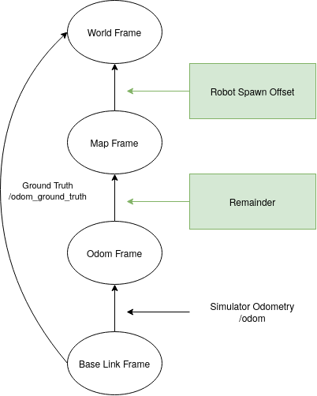

tuw_fake_localization
---

> Drop-in replacement of AMCL for Simulators

## Description

`tuw_fake_localization` fakes a typical localization system, such as AMCL, in a simulation environment, by using the ground truth odometry data. 

## Subscribed Topics

* `/odom_ground_truth (nav_msgs/Odometry)`: Ground truth odometry published by the simulation

## Published Topics

None

## Provided tf Transforms

* `<world_frame_id> -> <map_frame_id>`: Offset, as specified in the parameters `offset_`
* `<map_frame_id> -> <odom_frame_id>`: Ground truth odometry transform from simulation

## Parameters

* `world_frame_id`: Frame id of the world. Default: `world`
* `map_frame_id`: Frame id of the map. Default: Default: `map`
* `odom_frame_id`: Frame id of the odometry. Default: Default: `odom`
* `base_frame_id`: Frame id of the base link. Default: Default: `base_link`
* `offset_x`: The x offset between the origin of the world (simulator) coordinate frame and the map coordinate frame published by `tuw_fake_localization`.
* `offset_y`: See above.
* `offset_z`: See above.
* `offset_yaw`: See above.
* `offset_pitch`: See above.
* `offset_roll`: See above.

## ROS Coordinate Frames

In general, see the ROS [REP 105](https://www.ros.org/reps/rep-0105.html). Nonetheless, below is a short summary.

### `base_link`
Coordinate system attached to the robot.

### `odom`
Continuous, prone-to-drive coordinate system. Commonly wheeled-, imu- or visual-odometry.

### `map`
Non-continuous coordinate system by localization system.

### ´world´
Also sometimes called `earth`. Used to reference multiple robots or world-features

